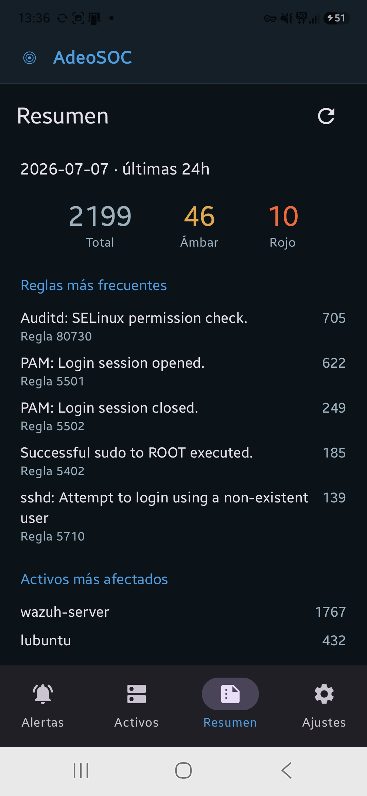
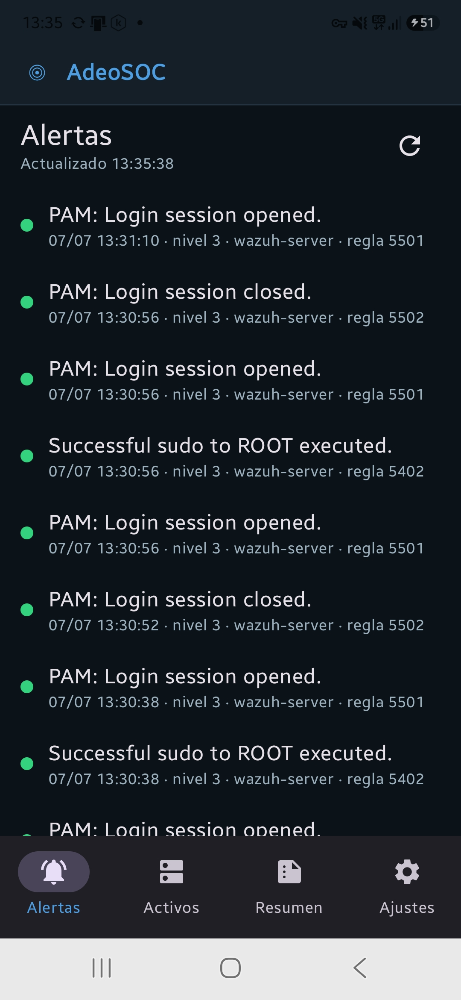
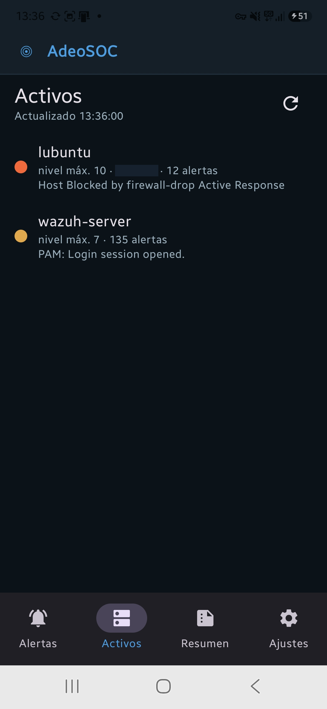
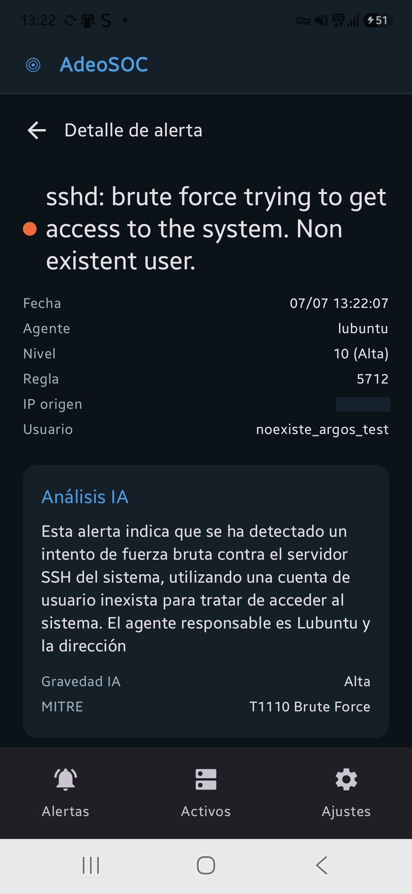
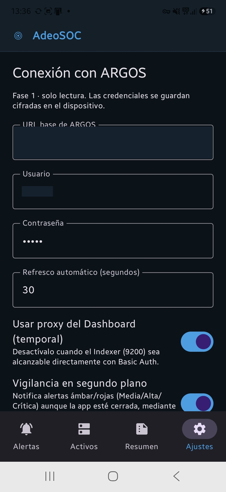

# AdeoSOC

  
  
  

App Android del proyecto **ARGOS**: cliente de bolsillo para un SOC doméstico basado en Wazuh, con vigilancia en segundo plano, notificaciones locales y enriquecimiento por IA. Nombre público **AdeoSOC** (`applicationId es.adeodato.adeosoc`); codename interno del repositorio y del código, **HERMES**.

El backend (Wazuh Manager, reglas de detección, Suricata, triage por IA) vive en el repositorio hermano [ARGOS](https://github.com/Adeodato-hub/ARGOS).

## Pestañas

- **Alertas** — lista en vivo con severidad por color, agente, regla, fecha/hora y detalle por alerta.
- **Activos** — un dispositivo por agente visto en las alertas, con semáforo verde/ámbar/rojo según su nivel más grave.
- **Resumen** — resumen de turno (últimas 24h) generado en el Manager y leído del índice `argos-shift-summary`.
- **Ajustes** — URL/usuario/contraseña de ARGOS, segundos de refresco, control de la vigilancia en segundo plano.

## Arquitectura

- **Kotlin + Jetpack Compose**, un solo módulo (`app`). `minSdk 29`, `targetSdk 36`.
- **Red**: `ArgosAlertsSource` define una interfaz con dos implementaciones intercambiables — Basic Auth directo contra el Indexer (modelo objetivo) y un proxy del Dashboard (atajo de desarrollo) — seleccionables desde Ajustes sin tocar código.
- **Vigilancia en segundo plano**: `AlertMonitorService`, un Foreground Service tipo `dataSync` que sondea ARGOS aunque la app esté cerrada, con reinicio tras reboot (`BootCompletedReceiver`) y exención de optimización de batería.
- **Notificaciones**: locales, para alertas de nivel Media/Alta/Crítica, con `AlertNotificationGate` evitando duplicados.
- **IA**: `EnrichmentSource` consulta el índice `argos-ai-enrichment` de forma no bloqueante para la lista de alertas (el análisis lo genera el pipeline de ARGOS contra Ollama, no la app).
- **Credenciales**: cifradas en el dispositivo con `EncryptedSharedPreferences` + Android Keystore (`AES256_GCM`/`AES256_SIV`) — nunca en texto plano.
- **Fase 1 = solo lectura**: ningún endpoint de escritura de ARGOS es alcanzable desde la app (sin `POST`/`PUT`/`DELETE` de respuesta activa).

## Capturas

Las cuatro pestañas en uso real contra ARGOS (`docs/evidencia/`). IPs internas, usuario y URL de conexión están redactados con una barra sólida sobre la captura original.

<table align="center">
<tr>
<td align="center"> Resumen — totales y reglas más frecuentes de las últimas 24h</td>
<td align="center"> Alertas — lista en vivo con severidad por color</td>
</tr>
<tr>
<td align="center"> Activos — agentes derivados de las alertas, con semáforo</td>
<td align="center"> Detalle de alerta — con análisis IA no bloqueante</td>
</tr>
<tr>
<td align="center" colspan="2"> Ajustes — conexión con ARGOS, credenciales cifradas en el dispositivo</td>
</tr>
</table>

## Estado

- **Fase 1** (cerrada): estructura de la app, notificaciones locales, APK de release firmada.
- **Fase 2** (cerrada): vigilancia en segundo plano, notificaciones ampliadas, enriquecimiento por IA no bloqueante, pestaña Resumen.

Detalle paso a paso en [`docs/`](docs/).

## Instalación

Ver [`docs/paso3-apk-instalacion.md`](docs/paso3-apk-instalacion.md) (build firmado, verificación de hash, instalación directa o por ADB).

## Seguridad

**Cerrado (Fase B, hardening — 2026-07-10):**

- [x] Usuario de solo lectura del Indexer: **cerrado** (`<USUARIO_RO_INDEXER>` / rol `adeosoc_readonly`, acotado a `wazuh-alerts-*`, `argos-ai-enrichment` y `argos-shift-summary`, sin permisos de escritura, más `backend_roles: kibanauser` para el proxy del Dashboard — detalle en `docs/paso0-api-wazuh.md` §9). La app ya usa `<USUARIO_RO_INDEXER>` en el dispositivo real; `admin/admin` jubilado del lado de la app.
- [x] Contraseña de la VM (`<USUARIO_SSH_VM>`): **rotada y verificada**.
- [x] Token de Telegram: **expuesto y ya revocado el 2026-07-01** — exposición cerrada antes de este repaso.
- [x] Firewall de Ollama en el host: las dos reglas genéricas `ollama.exe` (TCP/UDP, autogeneradas por Windows, antes abiertas a cualquier origen con perfil "Public") **deshabilitadas**. Solo queda activa la regla dedicada `Ollama - VirtualBox VM`, acotada a `10.0.2.0/24`.
- [x] `docs/paso0-api-wazuh.md` deja constancia de que `admin/admin` era solo el default de laboratorio de la OVA, ya retirado — ver §9.

**Pendiente:**

- [ ] Apuntar `custom-ollama` (lado ARGOS) a la IP correcta del host — el enriquecimiento por IA está caído ahora mismo (`Connection refused`) porque la IP del host cambió (`<IP_LAN_HOST_ANTIGUA>` → `<IP_LAN_HOST_NUEVA>`). Evaluar meter el host en la tailnet para depender de una IP Tailscale fija en vez de la IP LAN, que puede volver a cambiar.
- [ ] Verificar que la integración de Telegram usa el token vigente tras la revocación del 2026-07-01.
- [ ] `network.host` del Indexer (opción A del *known issue*, ver `docs/paso0-api-wazuh.md` §1) — el acceso directo al 9200 sigue sin resolverse; hoy la app depende del proxy del Dashboard.

## Autor

**Rafael Adiosdado Caballero Diéguez** (Adeodato)
