# AdeoSOC

  
  
  

Cliente Android de **ARGOS**: un SOC home-lab construido sobre **Wazuh** (herramienta de detección y respuesta de grado empresarial), con vigilancia en segundo plano, notificaciones locales, triage de alertas asistido por IA, respuesta activa de un toque y convergencia IT/OT en un único panel. Nombre público **AdeoSOC** (`applicationId es.adeodato.adeosoc`); codename interno del repositorio y del código, **HERMES**.

El backend (Wazuh Manager, reglas de detección, Suricata, triage por IA) vive en el repositorio hermano [ARGOS](https://github.com/Adeodato-hub/ARGOS).

## Pestañas

- **Alertas** — lista en vivo con severidad por color, agente, regla, fecha/hora y detalle por alerta. Filtro Todas/OT/IT/Críticas y etiqueta **OT** en las alertas del segmento de tecnología operativa (consulta dedicada al índice, no depende del lote reciente de IT). Botón **Bloquear IP** (`firewall-drop`) cuando hay IP de origen y **Deshabilitar cuenta** (`disable-account`) cuando hay usuario, ambos vía Active Response de Wazuh con diálogo de confirmación — en activos OT no se ocultan, se muestran con un aviso reforzado ("puede afectar a producción") antes de confirmar.
- **Activos** — un dispositivo por agente visto en las alertas (semáforo verde/ámbar/rojo según su nivel más grave), más los activos OT detectados por su propio poller, con detalle de exposición y telemetría.
- **Resumen** — resumen de turno (últimas 24h) generado en el Manager (`argos-shift-summary`) y tarjeta OT en vivo (activos, exposiciones abiertas, última alerta).
- **Ajustes** — URL/usuario/contraseña de ARGOS, segundos de refresco, control de la vigilancia en segundo plano.

## Arquitectura

- **Kotlin + Jetpack Compose**, un solo módulo (`app`). `minSdk 29`, `targetSdk 36`.
- **Red**: `ArgosAlertsSource` define una interfaz con dos implementaciones intercambiables — Basic Auth directo contra el Indexer (modelo objetivo) y un proxy del Dashboard (atajo de desarrollo) — seleccionables desde Ajustes sin tocar código.
- **Vigilancia en segundo plano**: `AlertMonitorService`, un Foreground Service tipo `dataSync` que sondea ARGOS aunque la app esté cerrada, con reinicio tras reboot (`BootCompletedReceiver`) y exención de optimización de batería.
- **Notificaciones**: locales, para alertas de nivel Media/Alta/Crítica, con `AlertNotificationGate` evitando duplicados.
- **IA**: `EnrichmentSource` consulta el índice `argos-ai-enrichment` de forma no bloqueante para la lista de alertas — narrativa en español (2-3 frases) + gravedad + técnica MITRE, generadas por el pipeline de ARGOS contra Ollama (no la app).
- **Respuesta activa**: `ActiveResponseSource` habla directo con la API nativa de Wazuh (puerto 55000, no el Dashboard/Indexer) — JWT vía `POST /security/user/authenticate`, luego `PUT /active-response` con `!firewall-drop` (Bloquear IP) o el comando estándar `!disable-account` (Deshabilitar cuenta; el AR custom no se ejecuta al invocarlo por API, solo el ruleset base de Wazuh). Usuario API dedicado (`adeosoc_ar`), con un rol acotado a un único permiso (`active-response:command`, sin lectura de agentes ni nada más) — nunca el admin (`wazuh-wui`) desde la app.
- **Credenciales**: cifradas en el dispositivo con `EncryptedSharedPreferences` + Android Keystore (`AES256_GCM`/`AES256_SIV`) — nunca en texto plano ni hardcodeadas, incluidas las de `adeosoc_ar`.

## Capturas

En uso real contra ARGOS. IPs internas, usuario y URL de conexión redactados sobre la captura original. Haz clic para ampliar.

<table>
  <tr>
    <td align="center" width="33%">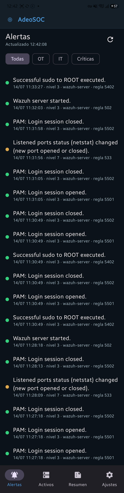 <b>Alertas</b> · feed en vivo</td>
    <td align="center" width="33%">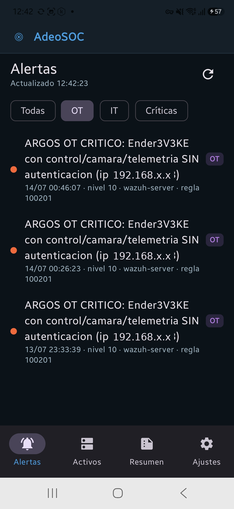 <b>Filtros</b> · Todas/OT/IT/Críticas</td>
    <td align="center" width="33%">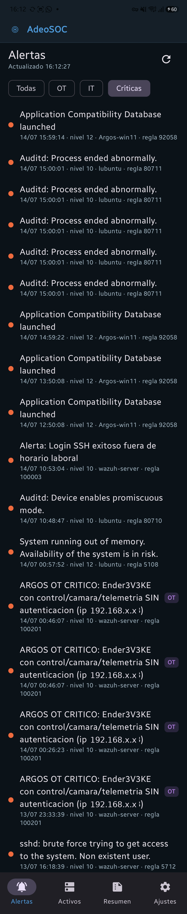 <b>Críticas</b> · nunca enterradas</td>
  </tr>
  <tr>
    <td align="center">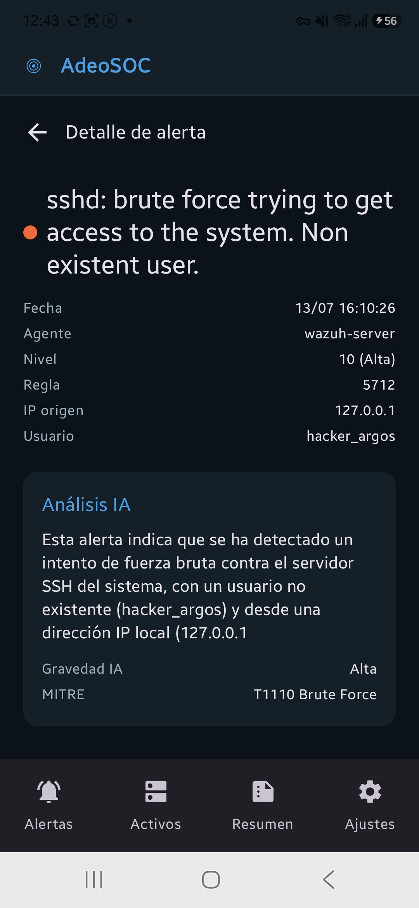 <b>Detalle</b> · IA + MITRE ATT&CK</td>
    <td align="center">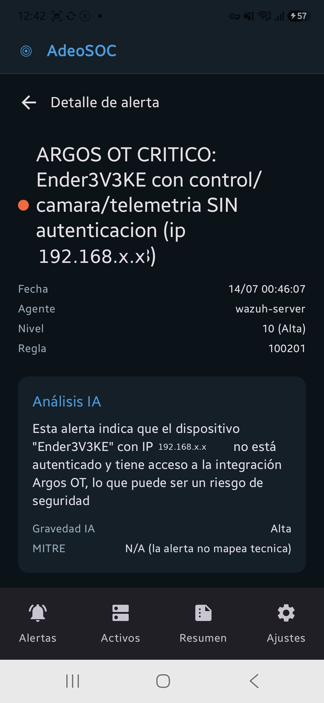 <b>OT crítico</b> · con análisis IA</td>
    <td align="center">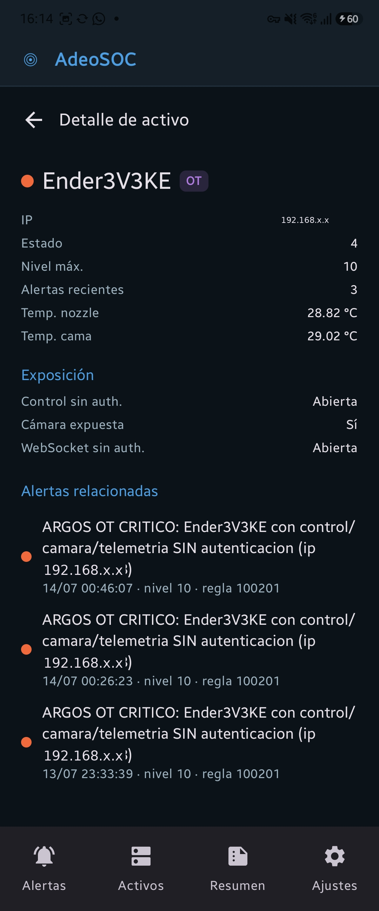 <b>Activo OT ⭐</b> · exposición + telemetría</td>
  </tr>
  <tr>
    <td align="center">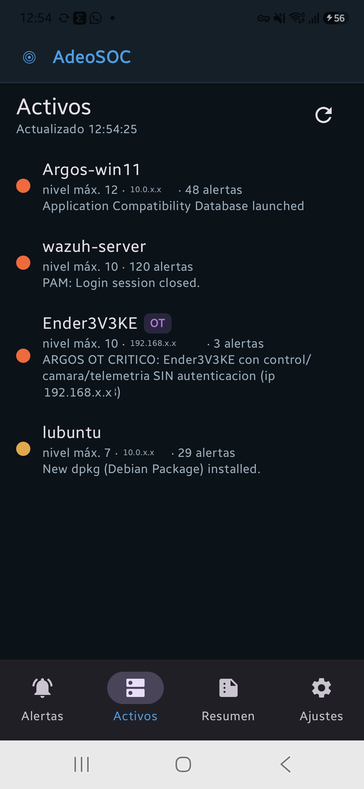 <b>Activos</b> · inventario con semáforo</td>
    <td align="center">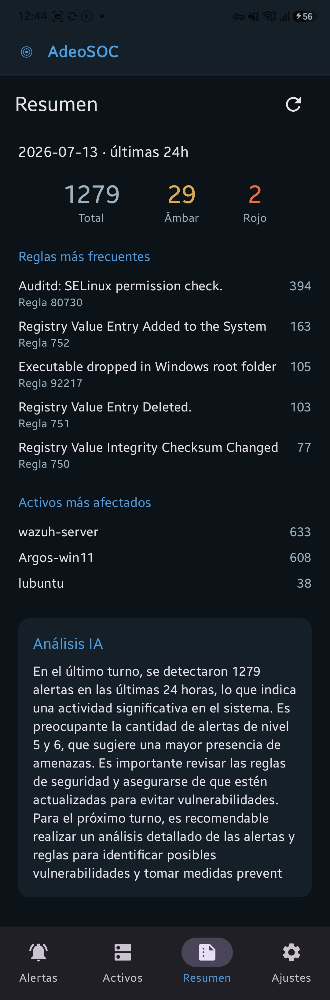 <b>Resumen</b> · métricas 24h + IA</td>
    <td align="center">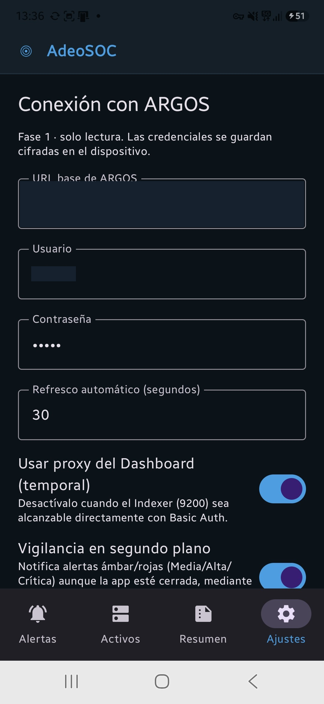 <b>Ajustes</b> · conexión al SOC</td>
  </tr>
  <tr>
    <td align="center">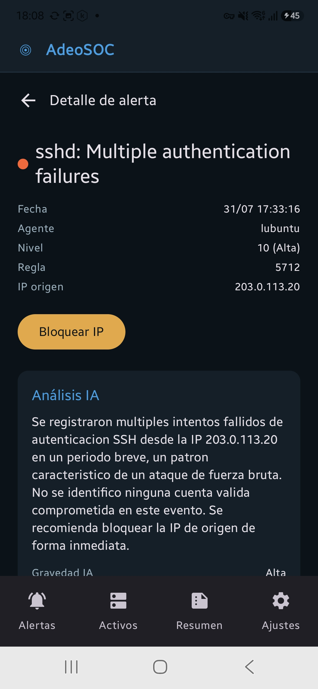 <b>Bloquear IP 🟠</b> · Active Response en 1 toque</td>
    <td align="center">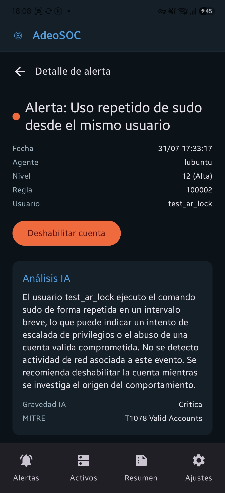 <b>Deshabilitar cuenta 🔴</b> · disable-account estándar</td>
    <td align="center">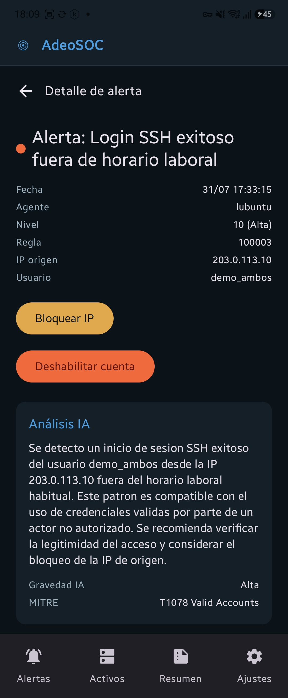 <b>Respuesta activa</b> · ambas acciones disponibles</td>
  </tr>
  <tr>
    <td align="center">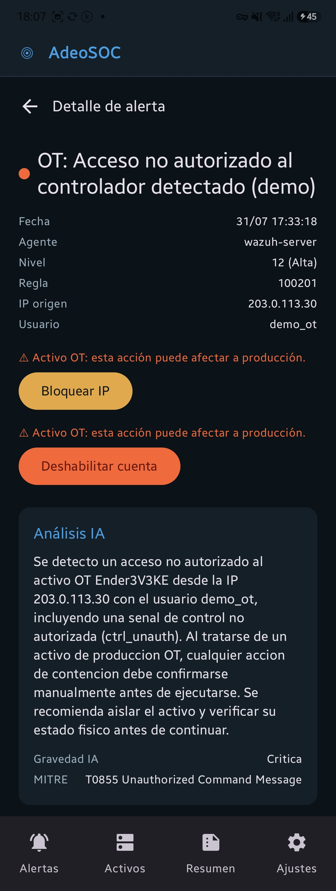 <b>Activo OT ⚠️</b> · confirmación reforzada</td>
    <td align="center"> <b>Regla propia</b> · login SSH fuera de horario, con Respuesta activa e IA</td>
    <td></td>
  </tr>
</table>

## Estado

- **Fase 1** (cerrada): estructura de la app, notificaciones locales, APK de release firmada.
- **Fase 2** (cerrada): vigilancia en segundo plano, notificaciones ampliadas, enriquecimiento por IA no bloqueante, pestaña Resumen.
- **Fase 3** (cerrada): convergencia IT/OT en un único panel — filtro y etiqueta OT en Alertas, activos OT con detalle de exposición/telemetría en Activos, tarjeta OT en vivo en Resumen.
- **Fase 4** (cerrada): respuesta activa desde el detalle de alerta — botones **Bloquear IP** (`firewall-drop`) y **Deshabilitar cuenta** (`disable-account`) vía un usuario API de mínimo privilegio (`adeosoc_ar`), con diálogo de confirmación; en activos OT no se ocultan, se muestran con un aviso reforzado. Cierra el círculo AdeoSOC → ARGOS → Active Response → trazado en el agente.

Detalle paso a paso en [`docs/`](docs/).

## Instalación

Ver [`docs/paso3-apk-instalacion.md`](docs/paso3-apk-instalacion.md) (build firmado, verificación de hash, instalación directa o por ADB).

## Seguridad

- [x] Usuario de solo lectura dedicado en el Indexer, acotado a los tres índices que la app necesita (`wazuh-alerts-*`, `argos-ai-enrichment`, `argos-shift-summary`), sin permisos de escritura — detalle en `docs/paso0-api-wazuh.md` §9.
- [x] Contraseña de acceso a la VM: rotada y verificada.
- [x] Token de Telegram: rotado y vigente.
- [x] Firewall del host acotado a la red del laboratorio; reglas genéricas de origen abierto deshabilitadas.
- [x] Enriquecimiento por IA operativo end-to-end (Manager → Ollama → app), con narrativa completa (sin cortes) y técnica MITRE.
- [x] Credenciales de la app nunca hardcodeadas: se introducen en Ajustes y se cifran en el dispositivo (`EncryptedSharedPreferences` + Android Keystore).
- [x] Respuesta activa con mínimo privilegio real: usuario API dedicado `adeosoc_ar`, rol acotado a un único permiso (`active-response:command`) — verificado que rechaza cualquier otra acción (403 al crear usuarios, visibilidad cero sobre el listado de agentes) y que nunca se usa el admin (`wazuh-wui`) desde la app.

## Roadmap

- [ ] Segmentación OT + Suricata — pendiente de disponer del hardware de laboratorio adicional.
- [ ] Soporte multi-SIEM vía capa de adaptador (hoy acoplado a Wazuh/OpenSearch).
- [ ] Botón "Desbloquear IP" (2ª iteración de la respuesta activa: revertir el `firewall-drop`).
- [ ] Botón "Reactivar cuenta" (revertir `disable-account`, contrapartida de "Deshabilitar cuenta").
- [ ] Aislamiento dedicado de activos OT (acción específica de contención). Hoy toda acción sobre un activo OT ya exige confirmación reforzada; el aislamiento como tal queda pendiente.

## Autor

**Rafael Adiosdado Caballero Diéguez** (Adeodato)
